class: list-space

<style>

.list-space li {
padding: 0.25cm;
}

.list-nobullet li {
  list-style-type:none;
}

.center2 {
  margin: 0;
  position: absolute;
  top: 30%;
  left: 40%;
  -ms-transform: translate(-35%, -35%);
  transform: translate(-35%, -35%);
}


</style>


```{r setup, load_refs, include=FALSE, cache=FALSE}
library(ggplot2)
library(dplyr)
library(tidyr)
library(scales)
library(RColorBrewer)
library(kableExtra)
library(purrr)


setwd("~/Dropbox/QUT_MPhil/1-ThesisMaster/3-Tranche1-EEG/3-DataAnalysis/QUT_MPhil/Paper2_BMA_clustering/ANZSC_2021/slides")

knitr::opts_chunk$set(cache = T, echo=F)

```


## Which clustering algorithm?


.pull-left[<iframe src="imgs/plot_3d_km.html" width="500" height="250" scrolling="yes" seamless="seamless" frameBorder="0"> </iframe>]

.pull-right[<iframe src="imgs/plot_3d_hc_colourfix.html" width="500" height="250" scrolling="yes" seamless="seamless" frameBorder="0"> </iframe>]

.pull-left[<iframe src="imgs/plot_3d_gmm.html" width="500" height="250" scrolling="yes" seamless="seamless" frameBorder="0"> </iframe>]


---

## Inconsistent clustering across algorithms

<iframe src="imgs/plot_3d_core_yellow.html" width="1000" height="500" scrolling="yes" seamless="seamless" frameBorder="0"> </iframe>


---

### Which clustering algorithm?

- Different algorithms will emphasise different aspects of clustering structure

--

- Choosing one 'best' model often arbitrary, unclear choice

--

  - `r emo::ji("right arrow")` **Inference not calibrated for model-based uncertainty**

--

- Locking into one method loses insights offered by other methods about plausible clustering structure

--

.pull-left[
```{r out.width=800}

knitr::include_graphics("imgs/porque.gif")

```
]

--

.pull-right[
**BMA offers a nice framework for combining clustering solutions**

  - simple
  
  - flexible

  - intuitive 
]
---
.pull-left[
#### *k*-means

- 'Hard' clustering
- Minimises within-cluster sums of squares]


.pull-right[**k-means objective function** <br>
$$J = \sum_{i = 1}^K (\sum_k{\lvert \lvert x_k - c_i \rvert \rvert ^2})$$]

--

.pull-left[
#### Hierarchical Clustering (Ward's Method)

- 'Hard' clustering
- Each observation starts out in its own cluster
- Repeated pairwise fusion of clusters that minimises change in within-cluster sums of squares (Ward)]


.pull-right[**Ward's objective function** <br>
$$D(c_1,c_2) = \delta^2(c_1,c_2) = \frac{\lvert c_1 \rvert \lvert c_2 \rvert }{\lvert c_1 \rvert + \lvert c_2 \rvert} \lvert \lvert c_1 - c_2 \rvert \rvert ^2$$]

--

.pull-left[
#### Gaussian Mixture Model
- 'Soft' clustering
- Models data as coming from a mixture of Gaussian distributions]

.pull-right[**Mixture of multivariate Gaussians** <br>
$$p(x_n|\mu, \Sigma, \pi,K) = \sum_{k=1}^K{\pi_k\mathcal{N}(x_n|\mu_k, \Sigma_k)}$$]


---


### Combining Clustering Results with Bayesian Model Averaging

--

- Limited development for Clustering
  - Finite mixture models (Russell et al., 2015)
  - Naive Bayes classifiers (Santafe & Lozano, 2006)
  - Lacks implementation across multiple clustering algorithms

--
<br>

**Advantages**

- `r emo::ji("cool")` Weighted averaging of results by model quality 

--

- `r emo::ji("100")` Intuitive framework for probabilistic **combination** & interpretation of results from multiple models

--

- `r emo::ji("sunglasses")` **Quantify model-based uncertainty and enable more robust inferences** calibrated accordingly


---

### Bayesian Model Averaging: Basics

<br>
<br>

$$P(\Delta | Y) = \sum_{l=1}^L (\Delta | Y, M_l)P(M_l|Y)$$


--
<br>
<br>

$$P(M_l|Y) = \frac{P(Y|M_l)P(M_l)}{\sum_{l=1}^L P(Y|M_l)P(M_l)}$$


---

#### BMA for Mixture Models - BIC weighting
- $P(Y|M_l)$ typically involves a difficult/intractable integral and is often approximated for many applications (Fragoso et al., 2018)

--

- **Russell et al. (2015)** weight results from multiple GMMs according to BIC

$$P(M_l \lvert Y) \approx \frac{exp(\frac{1}{2}{BIC}_l )}{\sum_{l=1}^L { exp(\frac{1}{2} BIC_{l}) }}$$

--

- BIC definition for GMM

$${BIC}_l = 2\log(\mathcal{L}) - \kappa_m \log(N)$$

--

- GMM likelihood

$$\mathcal{L}(\Theta) = \sum_{n=1}^N \sum_{k=1}^K{\pi_k\mathcal{N}(x_n|\mu_k, \Sigma_k)}$$
--

- Multivariate Gaussian density

$$\mathcal{N}(x|\mu, \Sigma) = \frac{\exp\left\{ -\frac{1}{2} (y-\mu)^T \Sigma^{-1}(y-\mu)\right\}}{|\Sigma|^{\frac{1}{2}} (2 \pi)^{\frac{D}{2}}}$$
                 
                 
---
background-image: url("imgs/separation_compactness.png")
background-position: right
background-size: 600px

### Aside: Cluster internal validation indices

.pull-left[.content-box-blue[
- Often used as a proxy for model quality in clustering
{{content}}
]
]
--

- Choose between candidate models with different numbers of clusters $k$

{{content}}
--

- Interpreted similarly to marginal likelihood/model evidence

{{content}}
--

- Typically measure compactness and/or separation of clusters

{{content}}
--
Compared to BIC...
  - Agnostic to clustering algorithm
  - Typically do not require likelihood term

---
background-image: url("imgs/separation_compactness.png")
background-position: top right
background-size: 300px


### New proposed weighting / approximation for posterior model probability

BIC for GMM driven by **Multivariate Gaussian density:**

$$\mathcal{N}(x|\mu, \Sigma) = \frac{\exp\left\{ -\frac{1}{2} (y-\mu)^T
                 \Sigma^{-1}(y-\mu)\right\}}{|\Sigma|^{\frac{1}{2}} (2 \pi)^{\frac{D}{2}}}$$
                 
--

**Xie-Beni index**
- Ratio of compactness to separation (maximise)
$$XB = \frac{\sum_i{\sum_{x \in C_i}d^2(x,c_i)}}{n(\min_{i, j \neq i} d^2(c_i,c_j))}$$

--

**Calinski-Harabasz Index**
- Ratio of separation to compactness (minimise)
$$CH = \frac{\sum_i{n_i d^2(c_i,c)/(NC-1)}}{\sum_i{\sum_{x \in C_i}d^2(x,c_i)/(n-NC)}}$$

--


- XB and CH have **complementary strengths** (Liu et al., 2010)

---

### New proposed weighting / approximation for posterior model probability

XB and CH indices
- conceptually and mathematically similar to BIC
- Unlike BIC, can be calculated + directly compared across different clustering algorithms

--

New proposed weight:
$$\mathcal{W}_m = \frac{\frac{1}{CH_{m}}}{\sum_{m=1}^M {\frac{1}{CH_{m}}}} + \frac{XB_m}{\sum_{m=1}^M {XB_{m}}}$$

<br>

--

Approximate posterior model probability for weighted averaging:
$$P(M_m \lvert Data) \approx \frac{\mathcal{W}_m}{\sum_{m=1}^M \mathcal{W}_m}$$


---

class: center, middle


## Case study: Clustering adolescents based on resting state EEG recordings


---

.pull-left[<iframe src="imgs/plot_3d_km.html" width="500" height="250" scrolling="yes" seamless="seamless" frameBorder="0"> </iframe>]

.pull-right[<iframe src="imgs/plot_3d_hc_colourfix.html" width="500" height="250" scrolling="yes" seamless="seamless" frameBorder="0"> </iframe>]

.pull-left[<iframe src="imgs/plot_3d_gmm.html" width="500" height="250" scrolling="yes" seamless="seamless" frameBorder="0"> </iframe>]

---

## Individual algorithms

.pull-left[**k-means** $\mathcal{W}_m = 0.36$
<br>
```{r out.width=300}
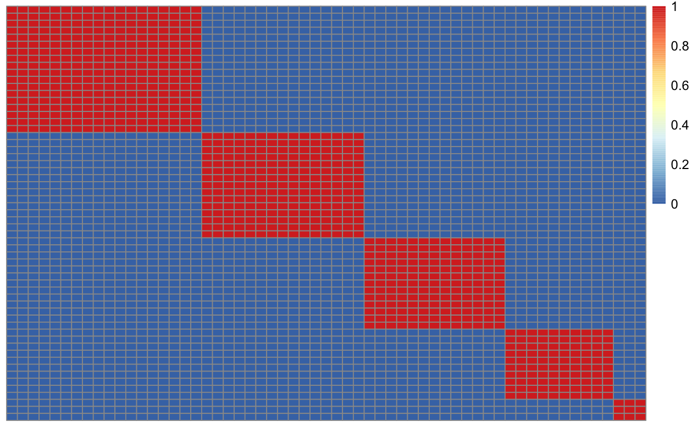
```
]

.pull-left[**HC** $\mathcal{W}_m = 0.27$
<br>
```{r out.width=300}
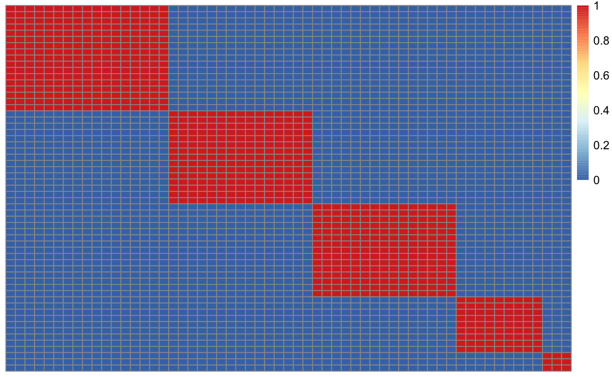
```
]

.pull-left[**GMM** $\mathcal{W}_m = 0.37$
<br>
```{r out.width=300}
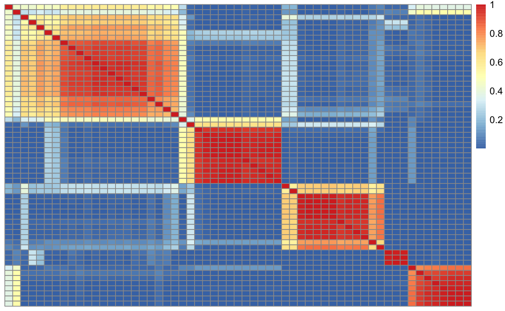
```
]


---

## Consensus matrix

```{r out.width=800}
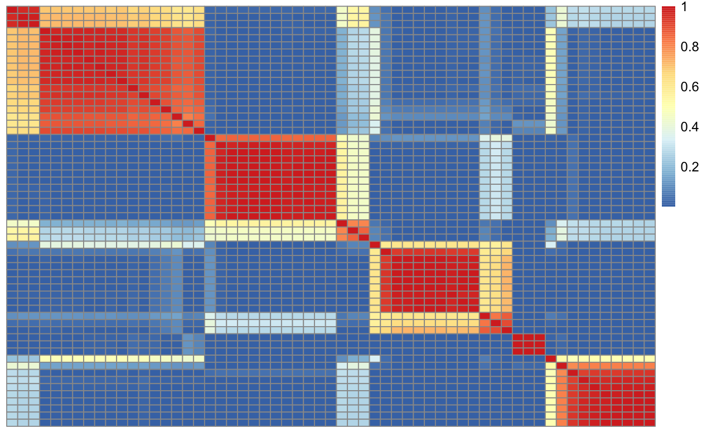
```


---

## Consensus dendrogram (Complete-linkage)

```{r out.width=800}
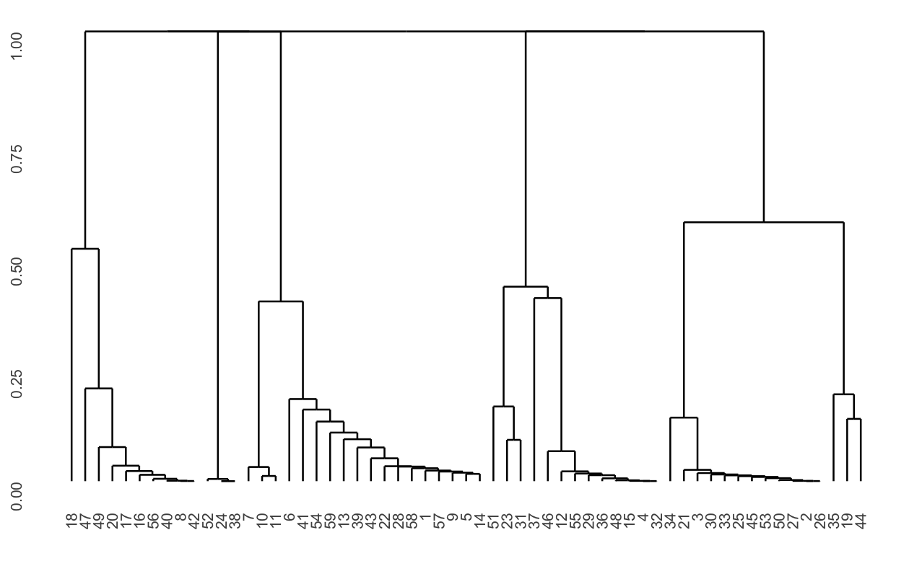
```


---


### BMA Clusters: weighted standard deviation of cluster probability (pairwise) across models


<iframe src="imgs/eeg_3d_BMA_size_sd.html" width="1000" height="500" scrolling="yes" seamless="seamless" frameBorder="0"> </iframe>


- **Uncertainty can be propagated forward for further analysis in a Bayesian framework**


---

class: center, middle


## Small simulation study

---

#### Simulated datasets - R package "clusterGeneration"

.pull-left[
Large separation
<br>
```{r out.width=300}
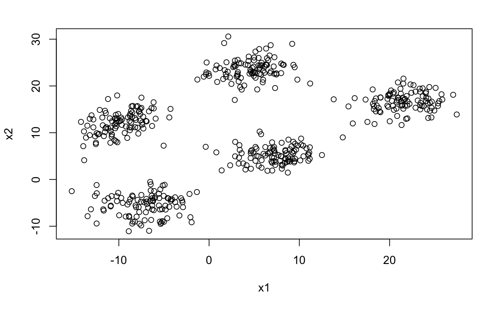
```
]

.pull-left[
Medium separation
<br>
```{r out.width=300}
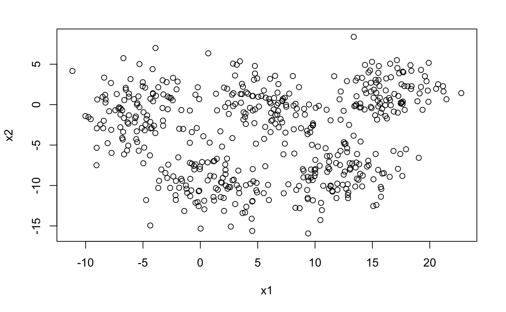
```
]

.pull-left[
Low separation
<br>
```{r out.width=300}
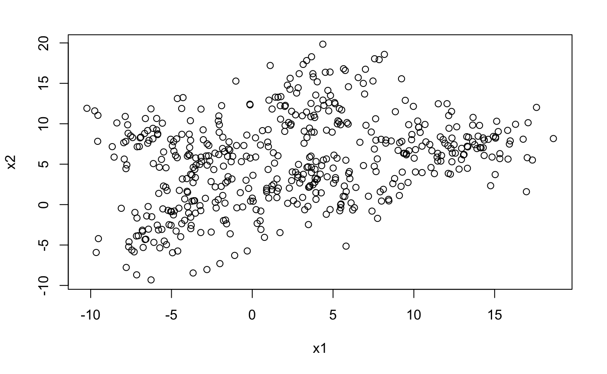
```
]


---
#### BMA solutions

.pull-left[
```{r out.width=600}
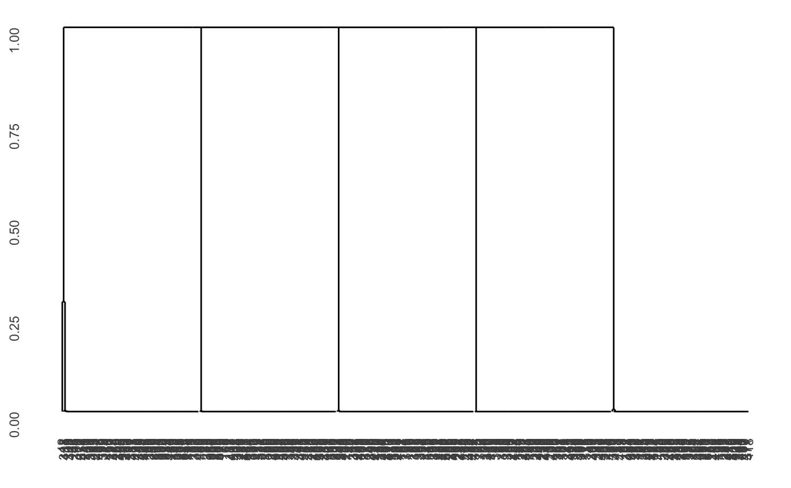
```
]

.pull-right[
```{r out.width=600}
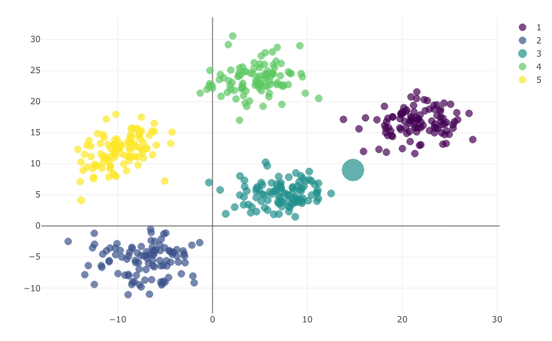
```
]

---
#### BMA solutions

.pull-left[
```{r out.width=600}
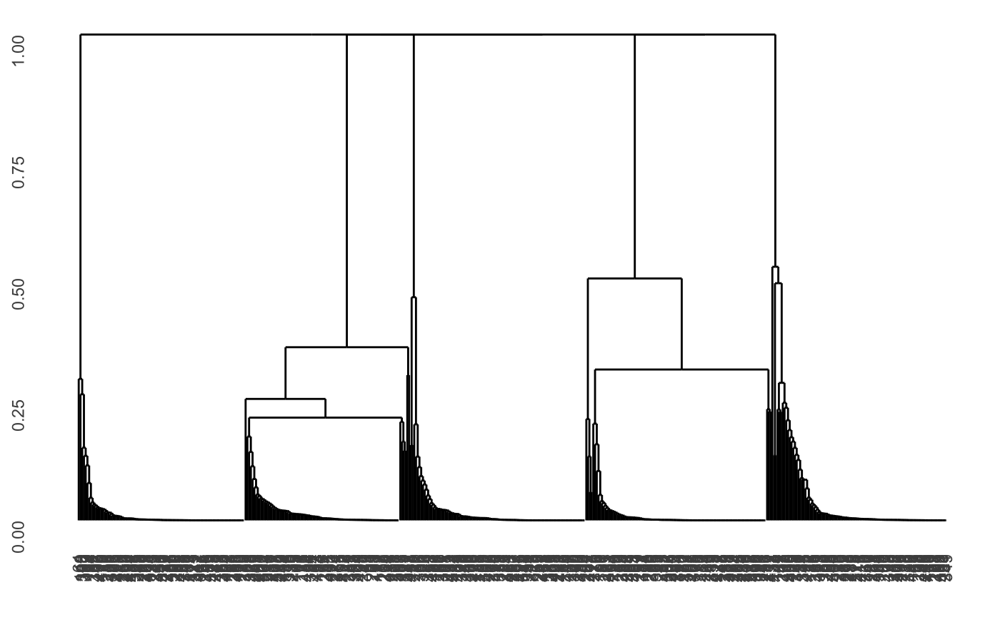
```
]

.pull-right[
```{r out.width=600}
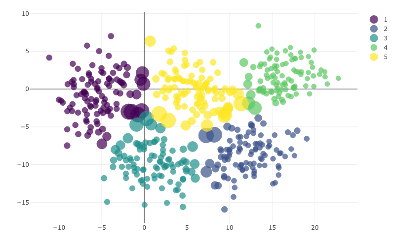
```
]

---
#### BMA solutions

.pull-left[
```{r out.width=600}
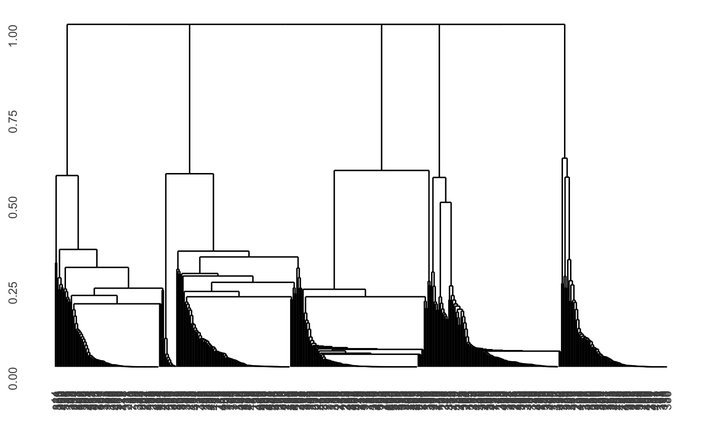
```
]

.pull-right[
```{r out.width=600}
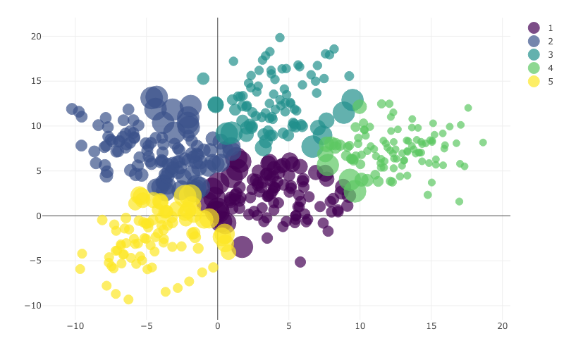
```
]

---

background-image: url("imgs/bernie_meme.jpg")
background-position: center
background-size: contain

---

### Next steps


**Preprint coming to Arxiv shortly**

- `r emo::ji("bird")` Twitter: **@oforbes22**

--

Extend simulation Study

- Investigate performance with more simulated clustering datasets in higher dimensions

- Look at ability to down-weight poor solutions

--

Case Study

- Propagate model-based uncertainty from BMA for cluster-based inferences

--


Publish R package for BMA across multiple clustering algorithms


---

### Key Reference

Russell, N., Murphy, T. B., & Raftery, A. E. (2015). Bayesian model averaging in model-based clustering and density estimation. arXiv preprint arXiv:1506.09035.


---

### Consistent quantity $\Delta$ - Similarity matrices

Previous work (Russell et al., 2015) has implemented BMA for model averaging across finite mixture models

--

- Each clustering model $M_l$ represented with pairwise similarity matrix $S^l$
  - each element $s_{ij}$ represents the probability that data points $i$ and $j$ belong to the same cluster in that model
  - **invariant to labelling and number of clusters**
  
--

```{r}

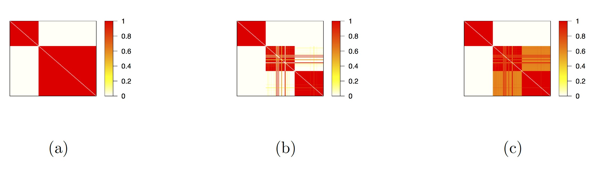

```

---


### BMA Clusters: weighted mean of cluster membership probability (pairwise) across models


<iframe src="imgs/eeg_3d_BMA_size_mean.html" width="1000" height="500" scrolling="yes" seamless="seamless" frameBorder="0"> </iframe>


---


