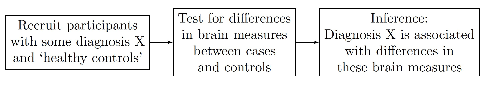
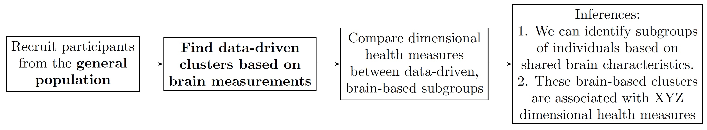
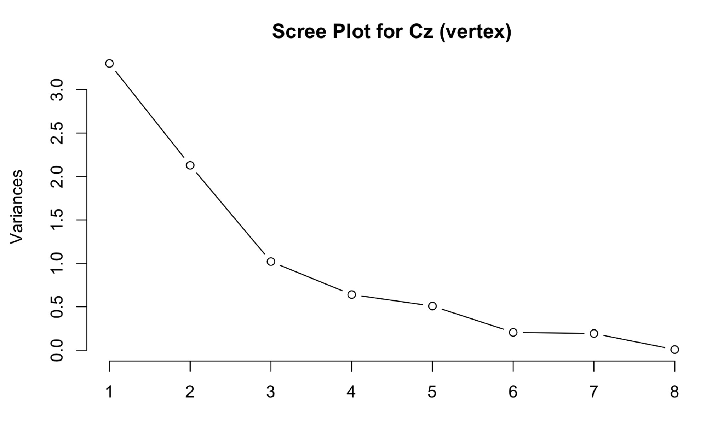
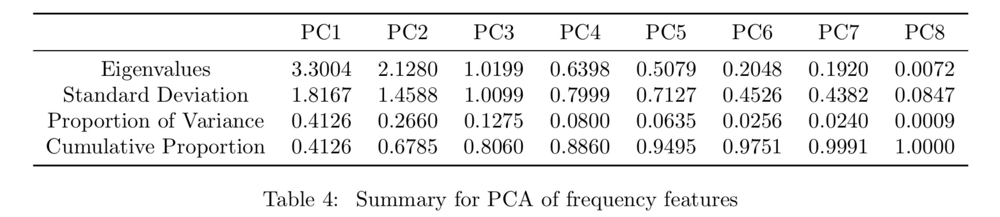
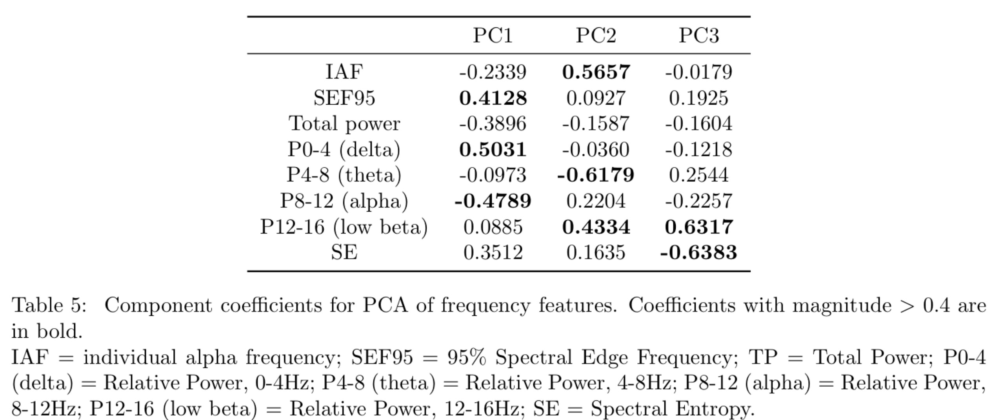
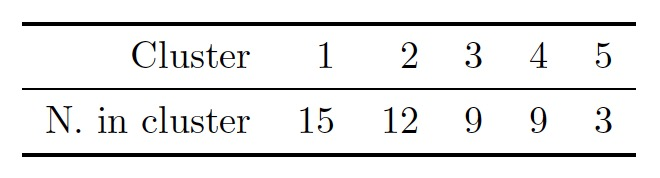
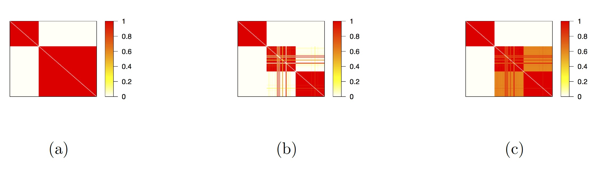
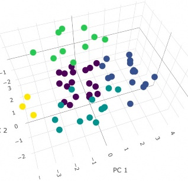
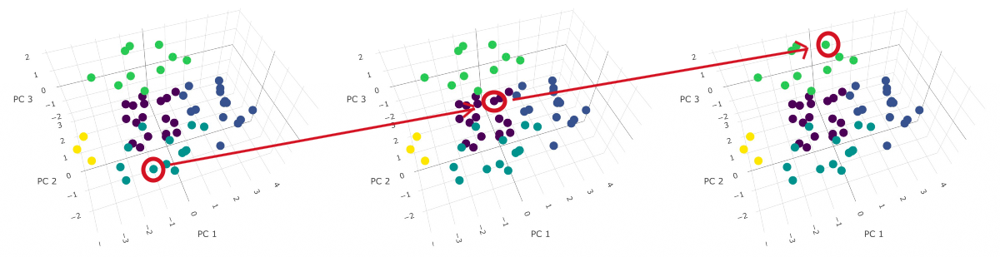
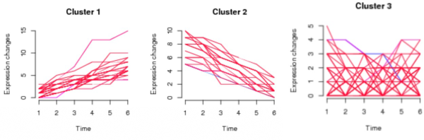

class: list-space

<style>

.list-space li {
padding: 0.25cm;
}

.list-nobullet li {
  list-style-type:none;
}

.center2 {
  margin: 0;
  position: absolute;
  top: 30%;
  left: 40%;
  -ms-transform: translate(-35%, -35%);
  transform: translate(-35%, -35%);
}


</style>


```{r setup, load_refs, include=FALSE, cache=FALSE}
library(ggplot2)
library(dplyr)
library(tidyr)
library(scales)
library(RColorBrewer)
library(kableExtra)
library(purrr)


setwd("~/Dropbox/QUT_MPhil/1-ThesisMaster/4-MILESTONES/Milestone2_Articulation/Seminar_slides/slides")

knitr::opts_chunk$set(cache = T, echo=F)

```


### Outline

1. Introduction
    - The Longitudinal Adolescent Brain Study (LABS)
    - Aims & Overview
2. Background & Literature Review
    - Mental Health & Neurophysiology
    - Statistical Methods
4. Research Plan
5. Progress to Date
6. Timeline & Next Steps

---

background-image: url("imgs/LABS.jpg")
background-position: right
background-size: contain

### The Longitudinal Adolescent <br>  Brain Study (LABS)

--
<br>
<br>
- Led by researchers at the Thompson Institute, USC

--

- Longitudinal cohort study of youth <br> population in the Sunshine Coast

--

- Follows participants over 5 years from age 12 to 17

--

- Recruitment goal: 500 participants

---

background-image: url("imgs/LABS.jpg")
background-position: right
background-size: contain

### The Longitudinal Adolescent <br>  Brain Study (LABS)


- Data collection every 4 months

--

**Mental health (self-report questionnaire)**

--

  - Distress (K10, SPHERE12)
  - Wellbeing (COMPAS-W)
  - Suicidality (SIDAS, YRBS)
  - Sleep quality (PSQI)

--

Psychiatric diagnostic interview

--

Cognitive testing battery 

--

**Neuroimaging**

--

- **Electroencephalography (EEG)** `r emo::ji("star")` `r emo::ji("brain")`
  
--
  
- Structural Magnetic Resonance Imaging (MRI)
  
--
  
- Functional MRI (fMRI)

---
### Aims & Overview
--

Using data from the Longitudinal Adolescent Brain Study, implement and extend statistical machine learning methods for analysing complex longitudinal data.

--

**Traditional approach**

--

```{r out.width=800}

```


--

**Our approach**

--

```{r out.width=1000}

```

---
### Aims & Overview

--
<br>
<br>
<br>
<br>
<br>
<br>
<br>
<br>
`r emo::ji("right arrow")` **Without knowing anything about LABS participants' mental health symptoms or diagnoses, what can we learn by using brain measurements to build data-driven clusters and profiles of individuals?**


---


class: middle, center

# Literature Review: Mental Health & Neurophysiology


---

### Mental Health in Adolescence

.content-box-blue[
- Mental health issues are a significant and growing problem in youth populations (Sawyer et al., 2018; McGorry & Mei, 2018)
]
--


.content-box-red[
- Many mental health problems & disorders are thought to emerge in adolescence; period of rapid brain development and change (Paus et al., 2008; McGorry et al., 2011)
]
--

.content-box-green[
- Mental health risk in childhood & adolescence is understood to be **pluripotential**
  - Non-specific risk overlaps across a number of clinical diagnostic categories (Raballo & Poletti, 2020; Hartmann et al., 2019)
]

--

- `r emo::ji("backhand index pointing right")` We need **improved data-driven statistical modeling** to better understand the <br> **complex relationships between neurophysiology and mental health in adolescence** `r emo::ji("brain")`

---
### Case-control and Data-driven Approaches

.pull-left[.content-box-blue[
**Case-control**
{{content}}
]]
--

- Identifies differences between diagnosed and undiagnosed groups
{{content}}

--

- Limited to find information within diagnostic categories based on clinical judgement
{{content}}

--

- Limited generalisability / replicability outside of sample (Latzman & DeYoung, 2020)


--

.pull-right[.content-box-red[
**Data-driven**
{{content}}
]]
--

- Identifies subgroups of symptoms or individuals based on patterns in data, rather than clinician judgement
{{content}}
--

- Prioritises population-based cohort studies (Latzman & DeYoung, 2020)
{{content}}
--

- Growing emphasis on data-driven EEG research to find new discoveries out of scope from traditional diagnostic categories (Loo et al., 2016; Keizer, 2019)

---
background-image: url("imgs/eeg_diag.gif")
background-position: right
background-size: 600px

### Electroencephalography (EEG)

<br>
<br>
<br>
<br>
- Records electrical brain activity <br> using electrodes on the scalp

- Signals represent cumulative activity <br> of rhythmic firing across networks <br> of many neurons <br>


---
background-image: url("imgs/eeg.jpg")
background-position: bottom right
background-size: 500px

### EEG Data: Strengths & Challenges

--
.pull-left[.content-box-blue[
**Strengths**
{{content}}
]]
--
- High temporal resolution for measuring oscillations & dynamic brain states (Burle et al., 2015)

{{content}}
--

- Low cost, widely available (Liedorp et al., 2009)

{{content}}
--

- Non-invasive, low participant burden

--

.pull-right[.content-box-red[
**Challenges**

{{content}}
]]
--
- Low signal-to-noise ratio (Wu et al., 2015)
  - Eye and muscle movements
  - Background electrical noise
  - Electrode contact quality
  
{{content}}
--

- Non-stationary (Sun and Zhou, 2014)
  - Significant variation in underlying processes

{{content}}
--

- High dimensionality 
  - Large number of channels & features
- Often small sample sizes

---

class: middle, center

# Literature Review: Statistical Methods


---
background-image: url("imgs/example_psd.jpg")
background-position:  bottom right
background-size: 500px

### EEG Frequency Decomposition

.pull-left[.content-box-blue[
Traditional frequency bands
{{content}}
]]
--


{{content}}
--

- Delta (~0-4 Hz)
- Theta (~4-8 Hz)
- Alpha (~8-12 Hz)
- Beta (~12-30 Hz)
- Gamma (~30 + Hz)

{{content}}
--

Mental Health

{{content}}
--


- Alpha asymmetry in depression (Kaiser et al., 2018)

{{content}}
--


- Some mental disorders show <br> `r emo::ji("down_arrow")` low frequency (delta, theta), <br>`r emo::ji("up_arrow")` high frequency (alpha, beta, gamma)
  - OCD, ADHD, Schizophrenia (Newson & Thiagarajan, 2019)
  
--
.pull-right[.content-box-red[
**Multitaper Analysis**
{{content}}
]]
--

- Suitable for non-stationary signals
- Used widely in EEG research (Babadi and Brown, 2014; Prerau et al., 2017)
- Good frequency specificity (Cohen, 2014)

---
### Data Reduction: Principal Component Analysis

.pull-left[.content-box-red[
- Popular & widely used method for data reduction
{{content}}
]]
--

- Captures the essential patterns of variation in data projected onto principal components (eigenvectors & eigenvalues)

{{content}}
--

- Commonly applied in EEG data reduction
  - Reduce frequency features for predicting neonatal seizures (Thomas et al., 2010)
  - Reduce frequency band power for motor signals in BCI (Ke & Li, 2009)

--

.pull-right[.content-box-blue[
- Runs into difficulties with high dimensionality (Feng et al., 2012)
  - Problematic as $P$ approaches $N$ `r emo::ji("thumbs_down")` `r emo::ji("dizzy_face")`

{{content}}
]]
--

- Limited to summarise information based on the selected inputs
  - In EEG context: manually calculated summary features


---
background-image: url("imgs/eeg_fpca.jpg")
background-position: bottom right
background-size: 500px

### Data Reduction: Functional Principal Component Analysis

.pull-left[.content-box-red[

- Captures the essential patterns of variation in functional data in terms of scores on **eigenfunctions** (Ramsay et al., 2009)

{{content}}
]]
--

- Capture information relating to a variety of summary features of interest with less difficulties around **high dimensionality**
  
{{content}}
--

- A few nice examples with EEG
  - Extract power components analogous to traditional frequency bands (Tenke & Keyser, 2005)
  - Bayesian fPCA in spatiotemporal domain for EEG artifact location and removal (Margaritella et al., 2020)

--

.pull-right[.content-box-blue[
Opportunities to extend in multiple functional domains (for EEG/biosignals)

{{content}}
]]
--

- 3D basis surfaces in time-frequency domain

{{content}}
--

- Spatially across EEG channels to look at complex dynamic patterns of synchronisation & functional connectivity

{{content}}
--

Under-utilised for EEG data; huge potential

---

### Unsupervised Clustering Methods

- Identify subgroups in data without existing group labels/classifications

--

- Different algorithms will emphasise different aspects of clustering structure

--

- Choosing one 'best' model often arbitrary, unclear choice
  - Doesn't account for model-based uncertainty

--

- Value in combining/integrating across multiple algorithms

---
.pull-left[
#### *k*-means

- 'Hard' clustering
- Minimises within-cluster sums of squares]


.pull-right[**k-means objective function** <br>
$$J = \sum_{i = 1}^K (\sum_k{\lvert \lvert x_k - c_i \rvert \rvert ^2})$$]

--

.pull-left[
#### Hierarchical Clustering (Ward's Method)

- 'Hard' clustering
- Each observation starts out in its own cluster
- Repeated pairwise fusion of clusters that minimises change in within-cluster sums of squares (Ward)]


.pull-right[**Ward's objective function** <br>
$$D(c_1,c_2) = \delta^2(c_1,c_2) = \frac{\lvert c_1 \rvert \lvert c_2 \rvert }{\lvert c_1 \rvert + \lvert c_2 \rvert} \lvert \lvert c_1 - c_2 \rvert \rvert ^2$$]

--

.pull-left[
#### Gaussian Mixture Model
- 'Soft' clustering
- Models data as coming from a mixture of Gaussian distributions
- Restrictive distribution ('thin tails')
  - Tends to prioritise cluster compactness, may tend to 'overcluster']

.pull-right[**Mixture of multivariate Gaussians** <br>
$$p(x_n|\mu, \Sigma, \pi,K) = \sum_{k=1}^K{\pi_k\mathcal{N}(x_n|\mu_k, \Sigma_k)}$$]


---


### Combining Clustering Results

--

#### Intersecting / Overlapping 'Core' Clusters
- Identify consistent groupings
- No allocation for inconsistently clustered points

--

#### Bayesian Model Averaging

--

- Weighted averaging of results by model quality
- Quantification of model-based uncertainty

--

$$P(\Delta | Y) = \sum_{l=1}^L (\Delta | Y, M_l)P(M_l|Y)$$

--

- Limited development for Clustering
  - Finite mixture models (Russell et al., 2015)
  - Naive Bayes classifiers (Santafe & Lozano, 2006)
  
--

- Lacks implementation across multiple clustering algorithms

---
background-image: url("imgs/cat_eeg_crop.png")
background-position: center
background-size: contain

class: top, left, inverse

<br>
<br>
<br>
<br>
# How shall I skin thee? <br> Let me count the ways...


---

background-image: url("imgs/cat_knife_1.jpg")
background-position: center
background-size: contain

class: top, left, inverse

---

background-image: url("imgs/cat_knife_2.jpg")
background-position: center
background-size: contain

class: top, left, inverse

---

class: middle, center 

# Research Plan


---
### Research Streams

**MPhil**
--
.full-width[.content-box-red[**Stream 1**: Data reduction with PCA using summary features calculated from electroencephalography (EEG) data, and integrated robust clustering of individuals]]
<br>
--
**PhD**
--
.full-width[.content-box-blue[**Stream 2**: Data reduction with functional PCA in frequency, time-frequency & spatial domains for EEG data, and integrated robust clustering of individuals]]
--
.full-width[.content-box-green[**Stream 3**: Integrative modeling framework to combine and find intersections between EEG analyses and other types of neuroimaging data]]

---
### Main Objectives (methodological focus)

.pull-left[
.content-box-blue[**Stream 1 (MPhil) - PCA focus**

{{content}}
]
]
--

- M1.1: Data Reduction with PCA

{{content}}
--

- M2: Integrated Robust Clustering
  - M2.1: Intersecting 'core' clusters across multiple clustering algorithms
  - M2.2: Extending Bayesian Model Averaging for clustering

{{content}}
--

- M3: Spatial and Temporal Extensions to Clustering
  - M3.1: Extending work under M2 spatially across multiple EEG channels
  - M3.2: Extending work under M2 temporally across multiple LABS timepoints


--

.pull-right[
.content-box-red[**Stream 2 (PhD) - fPCA focus**

{{content}}
]
]
--

- M1.2: Data reduction with fPCA

{{content}}
--

- M4: Integrated Robust Clustering

{{content}}
--

- M5: Spatial and Temporal Extensions to Clustering

{{content}}
--

**Stream 3 (PhD)**

{{content}}
--

- M6: Integrative Models for Multimodal Neuroimaging Data

---

### Applied components


.pull-left[
.content-box-blue[**Stream 1 (MPhil)**

{{content}}
]
]
--

- M2a: Relating Health Outcomes to EEG-based Clustering (PCA Stream)
  - M2a.1: Compare health outcomes between integrated core clusters
  - M2a.2: Compare health outcomes between BMA clusters (propagate model-based uncertainty)

{{content}}
--

- M3: Spatial and Temporal Extensions to Clustering (PCA Stream)
  - M3a.1: Relate health outcomes to regional patterns of brain activity & functional connectivity
  - M3a.2: Relate longitudinal health outcomes to PCA-based clustering over multiple LABS time points


--

.pull-right[
.content-box-red[**Stream 2 (PhD)**

{{content}}
]
]
--

- M4a: Relating Health Outcomes to EEG-based Clustering (fPCA Stream)

{{content}}
--

- M5a: Relating Health Outcomes to Spatial and Temporal Extensions (fPCA Stream)

{{content}}
--

**Stream 3 (PhD)**

{{content}}
--

- M6a: Relating Health Outcomes to Integrative Multimodal Models (Integration
Stream)

---
### Novel Contributions

--
#### Methodological `r emo::ji("nerd_face")`

--

- Extensions to Bayesian Model Averaging to enable integration of results across multiple clustering algorithms

--

- Extensions to fPCA for biosignals data (frequency, temporal, spatial) (Stream 2)

--

- Improve robustness of candidate integrative models for use with multi-modal, high-dimensional, small sample size data (Stream 3)

--

**Scaleable, flexible & open source analysis pipelines**

--

- MATLAB & R Code for: automated EEG pre-processing; multitaper analysis; PCA & integrated robust clustering

--

- R package for BMA across multiple clustering algorithms

---
### Novel Contributions

--

#### Applied `r emo::ji("sunglasses")`

--

- First work to implement unsupervised clustering using EEG data from a population sample of adolescents

--

- New insights about spatiotemporal brain dynamics/features from fPCA extensions in multiple functional dimensions (Stream 2)

--

- New insights about correspondence between EEG-based analyses and other brain measures in this age range (Stream 3)

--

- Novel framework for clinical risk prediction to support early intervention for brain development & mental health in adolescence

--


---


class: middle, center 

## Progress to Date: EEG-based Integrated Clustering 
#### Paper 1 (Objectives 1.1, 2.1 & 2a.1)


---
### Progress to Date: EEG-based Integrated Clustering 

--

**Data scope**

--

- Cross-sectional data (time point 1)

--

- 59 participants (age 12 years)

--

- Resting state, eyes closed EEG

--

- One channel (vertex Cz)

--

- Frequency domain analyses

 
--

**Research Questions**
--

- From PCA results, which combinations and contrasts between EEG frequency features explain the most variability across individuals?

--

- How can results across different unsupervised clustering algorithms be combined to identify consistently separated core clusters?

--

- How do individuals across clusters vary in terms of EEG characteristics and health outcomes


---

### Methods

- Data Preparation: Automated Pre-processing `r emo::ji("exclamation")` `r emo::ji("star")`

--

- Data Preparation: Multitaper Analysis & Feature Selection
  - Relative power in 4 Hz bands (delta, theta, alpha, low beta)
  - Total power
  - Individual Alpha Frequency
  - 95% Spectral Edge Frequency
  - Spectral Entropy

--

- Data Reduction: PCA

--

- Unsupervised Clustering Methods
  - k-means
  - Hierarchical clustering (Ward's method)
  - Gaussian Mixture Model

--

- Integrating Results to find Core Clusters
  - Find well-differentiated groups consistent across methods


---
### Results: PCA

.center2[
```{r PCA_results_1, echo=F, out.width="1200px"}


```
]
---
### Results: PCA
.center2[
```{r PCA_results_2, echo=F, out.width="1600px"}


```
]


---

### Results: PCA

.center2[
```{r PCA_results_3, echo=F, out.width="1600px"}


```
]


---

class: center, middle

## Results: Unsupervised clustering


---

.pull-left[<iframe src="imgs/plot_3d_km.html" width="620" height="320" scrolling="yes" seamless="seamless" frameBorder="0"> </iframe>]

.pull-right[<iframe src="imgs/plot_3d_hc_colourfix.html" width="620" height="320" scrolling="yes" seamless="seamless" frameBorder="0"> </iframe>]

.pull-left[<iframe src="imgs/plot_3d_gmm.html" width="620" height="320" scrolling="yes" seamless="seamless" frameBorder="0"> </iframe>]


---
### Results: Core Clusters

<iframe src="imgs/plot_3d_core_only.html" width="1200" height="600" scrolling="yes" seamless="seamless" frameBorder="0"> </iframe>


```{r out.width = 200}


```

---
background-image: url("imgs/core_psds_combined.png")
background-position: bottom
background-size: contain


---
### Next Steps

- Compare health outcome measures between core clusters 

--

  - Use a Bayesian approach to compare health outcomes between groups, especially given small sample size

--

  - May need to wait for more LABS data to enable stronger inferences about differences in health outcomes between clusters
  
--

Complete and submit Paper 1 to applied journal e.g. *Evidence-Based Mental Health (BMJ)* (April 2021)


---


class: middle, center 

## Progress to Date: Extending Bayesian Model Averaging for Clustering <br>
#### Paper 2 (Objectives 2.2 & 2.2a)


---

### Extending Bayesian Model Averaging for Clustering

--

Inference based on results from a single 'best' model ignore the uncertainty that arises from model selection

--

- *M*-open scenario: the appropriate model class is not known in advance, but is determined iteratively as the analysis proceeds (Bernardo & Smith, 2009)

--

$$P(\Delta | Y) = \sum_{l=1}^L (\Delta | Y, M_l)P(M_l|Y)$$

--

- For valid inference in the clustering context, $\Delta$ should have the same meaning for all models and all $k$, and be invariant to labelling of $k$ (Hoeting 2002)


Where
$$P(M_l|Y) = \frac{P(Y|M_l)P(M_l)}{\sum_{l=1}^L P(Y|M_l)P(M_l)}$$

--

- Enables more robust inference through probabilistic combination of outputs from multiple models


---

### Extending Bayesian Model Averaging for Clustering

Previous work (Russell et al., 2015) has implemented BMA for model averaging across finite mixture models

--

- Each clustering model $M_l$ represented with pairwise similarity matrix $S^l$
  - each element $s_{ij}$ represents the probability that data points $i$ and $j$ belong to the same cluster in that model
  - **invariant to labelling and number of clusters**
  
--

```{r}



```


---

### BMA for Mixture Models - BIC weighting

- $P(Y|M_l)$ typically involves a difficult/intractable integral and is often approximated for many applications (Fragoso et al., 2018)

--

- Russell et al. (2015) weight results from multiple GMMs according to BIC

$$P(M_l \lvert Y) \approx \frac{exp(\frac{1}{2}{BIC}_l )}{\sum_{l=1}^L { exp(\frac{1}{2} BIC_{l}) }}$$

--

- BIC definition for GMM

$${BIC}_l = 2\log(\mathcal{L}) - \kappa_m \log(N)$$

--

- GMM likelihood

$$\mathcal{L}(\Theta) = \sum_{n=1}^N \sum_{k=1}^K{\pi_k\mathcal{N}(x_n|\mu_k, \Sigma_k)}$$
--

- Multivariate Gaussian density

$$\mathcal{N}(x|\mu, \Sigma) = \frac{\exp\left\{ -\frac{1}{2} (y-\mu)^T \Sigma^{-1}(y-\mu)\right\}}{|\Sigma|^{\frac{1}{2}} (2 \pi)^{\frac{D}{2}}}$$
                 
                 
---
background-image: url("imgs/separation_compactness.png")
background-position: right
background-size: 600px

### Aside: Cluster internal validation indices

.pull-left[.content-box-blue[
- Often used as a proxy for model quality in clustering
{{content}}
]
]
--

- Typically measure compactness and/or separation of clusters

{{content}}
--

- Choose between candidate models with different numbers of clusters $k$

{{content}}
--

- Interpreted similarly to model evidence
  - Agnostic to clustering algorithm
  - Most do not require likelihood term

---
background-image: url("imgs/separation_compactness.png")
background-position: top right
background-size: 300px


### New proposed weighting / approximation for posterior model probability

BIC for GMM driven by **Multivariate Gaussian density:**

$$\mathcal{N}(x|\mu, \Sigma) = \frac{\exp\left\{ -\frac{1}{2} (y-\mu)^T
                 \Sigma^{-1}(y-\mu)\right\}}{|\Sigma|^{\frac{1}{2}} (2 \pi)^{\frac{D}{2}}}$$
                 
--

**Xie-Beni index**
- Ratio of separation to compactness (maximise)
$$XB = \frac{\sum_i{\sum_{x \in C_i}d^2(x,c_i)}}{n(\min_{i, j \neq i} d^2(c_i,c_j))}$$

--

**Calinski-Harabasz Index**
- Ratio of separation to compactness (minimise)
$$CH = \frac{\sum_i{n_i d^2(c_i,c)/(NC-1)}}{\sum_i{\sum_{x \in C_i}d^2(x,c_i)/(n-NC)}}$$

--


- XB and CH have complementary strengths (Aggarwal & Reddy, 2012)

---

### New proposed weighting / approximation for posterior model probability
<br>
New proposed weight:
$$\mathcal{W}_m = \frac{\frac{1}{CH_{m}}}{\sum_{m=1}^M {\frac{1}{CH_{m}}}} + \frac{XB_m}{\sum_{m=1}^M {XB_{m}}}$$

Approximate posterior model probability for weighted averaging:
$$P(M_m \lvert Data) \approx \frac{\mathcal{W}_m}{\sum_{m=1}^M \mathcal{W}_m}$$


---
### Next Steps

--
Simulation Study

- Investigate performance with simulated clustering datasets

--

Case Study

- Demonstrate utility for leveraging insights from multiple clustering methods (LABS EEG data)


--

Submit paper to *Advances in Data Analysis and Classification* in June 2021

--

Publish R package for BMA across multiple clustering algorithms


---
class: center, middle

# Upcoming Work

---
background-image: url("imgs/func_conn.jpg")
background-position: right
background-size: 500px

### MPhil Research Plan: Objective 3.1

#### Spatial extensions

--
.pull-left[
Select & calculate expanded feature set across multiple channels
- Functional connectivity measures
- Asymmetry measures (Duffy et al, 1996; Jin et al., 2020)

{{content}}
]
--

- With expanded spatial feature set, implement PCA and robust clustering from Objective 2

---
### MPhil Research Plan: Objective 3.2

#### Temporal extensions

--

- Apply pipelines from Objectives 2 and 3 across multiple timepoints
  - Examine changes in cluster structure & membership over time
  
```{r out.width=600}

```

--
<br><br>
```{r out.width=600}


```


---
### MPhil Research Plan: Objective 3.2

#### Temporal extensions
--

- Implement longitudinal clustering / trajectory analysis to identify longitudinal paths of EEG profiles through adolescence

--

```{r out.width=400}

```

--

- Growth mixture models
  - Applied to developmental mental health data (Muthen, 2006; Connell & Frye, 2006)
  
--

Exemplar work: "Methods for personalised predictive modelling of developmental milestones for children with disabilities" (Gilholm, 2020)
  - Longitudinal clustering methods for developmental trajectories
  

---
### PhD Research Plan: Stream 2 (fPCA)

- **PCA-based approach is limited**

--

  - Manual selection of features
  
--

  - Curse of dimensionality - limited scope

--

- **fPCA is under-utilised for EEG data and has exciting potential**

--

  - No requirement for choosing a priori features of interest

--

  - Reveal insights about complex patterns of dynamic brain activity across multiple functional domains (frequency, temporal & spatial)

--

  - Identify novel data features beyond scope of traditional analyses

---
background-image: url("imgs/3d_fpca.jpg")
background-position: top right
background-size: 400px

### PhD Research Plan: Stream 2 (fPCA)

--

**M1.2 & M4**: Frequency domain, cross-sectional

- **Tenke & Kayser (2005)**
  - Frequency domain fPCA to identify spectral power components

--

**M5.1**: Spatial extensions
- Asymmetry & regional activity patterns

- **Margaritella et al. (2020)**
  - Bayesian fPCA with EEG in frequency domain; spatial clustering across channels

--

**M5.2**: Time-frequency extensions
- Dynamic patterns of connectivity & synchronisation

- **Hasenstab et al. (2017)**
  - fPCA with EEG combining experimental and longitudinal time scales (Task-based, ERP)


---

### Research Plan: Stream 3 (Integration)

--

Intersections between EEG and other neuroimaging types

--

Novel hypothesis generation - collaboration with LABS investigators

--

- EEG functional connectivity compared to structural connectivity from Diffusion Tensor Imaging

--

- EEG asymmetry measures compared to brain region volumes across hemispheres from structural MRI

--

**Candidate methods:**

--

- Dynamic Bayesian Networks

--

- Bayesian Hierarchical Models


---

class: center, middle

# Research Timeline

---
background-image: url("imgs/timeline.jpg")
background-position: top
background-size: contain


---

### Publications


- Paper 1: EEG-based clusters in a population sample of adolescents (applied focus)
  - Objectives M1.1, M2.1, M2a.1; Anticipated submission April 2021
  - Target Journal: *Evidence-Based Mental Health (BMJ)*

- Paper 2: Extending BMA for multiple clustering algorithms (methods focus)
  - Objective M2.2, M2a.1; Anticipated submission June 2021
  - Target Journal: *Advances in Data Analysis and Classification*
  
--

(if successful in Articulation)

--

- Paper 3: Extending fPCA for biosignals in multiple functional domains (methods focus)
  - Objectives M1.2, M4, M5; Anticipated submission February 2022
  - Target Journal: *Statistics in Medicine*
  
--

- Paper 4: Mapping longitudinal trends in EEG to structural and functional MRI measures (methods & applied)
  - Objectives M3, M5, M6; Anticipated submission September 2022
  - Target Journal: *Frontiers in Neuroscience*

  

---

#### Conferences
- QLD AI Hub Medical Datathon 2020
- Submitted abstract to ANZSC 2021

--

#### Coursework
- Advanced Information Research Skills (IFN001) - March 2020
- Minor Project (MXN401) - Semester 1, 2020
- Modern Statistical Computing Techniques (MXN442) - Semester 2, 2020
- Advanced Statistical Data Analysis (MXN600) - Semester 2, 2020


--

#### Other Scholarly Activities
- Submitted paper with ANU epidemiology colleagues to *Environmental Health Perspectives* (first author)
- Co-Chair of BRAG Group, **July 2020 - Present**
- Wellbeing Officer, SEF HDR Society **August 2020 - Present**
- Host of fortnightly HDR wellbeing workshop "Peers & Pizza" **October 2020 - Present**


---

### References

Aggarwal, C. C. and Reddy, C. K. (2014). Data clustering: Algorithms and applications. Chapman Hall/CRC Data mining and Knowledge Discovery Series. London.

Babadi, B., & Brown, E. N. (2014). A review of multitaper spectral analysis. IEEE Transactions on Biomedical Engineering, 61(5), 1555-1564.

Bernardo, J. M. and Smith, A. F. (2009). Bayesian theory, volume 405. John Wiley Sons.

Bruckers, L., Molenberghs, G., Drinkenburg, P., & Geys, H. (2016). A clustering algorithm for multivariate longitudinal data. Journal of biopharmaceutical statistics, 26(4), 725-741.

Burle, B., Spieser, L., Roger, C., Casini, L., Hasbroucq, T., and Vidal, F. (2015). Spatial and temporal resolutions of EEG: Is it really black and white? A scalp current density view. International Journal of Psychophysiology, 97(3):210-220.

Cohen, M. X. (2014). Analyzing neural time series data: theory and practice. MIT press.

Connell, A. M., & Frye, A. A. (2006). Growth mixture modelling in developmental psychology: Overview and demonstration of heterogeneity in developmental trajectories of adolescent antisocial behaviour. Infant and Child Development: An International Journal of Research and Practice, 15(6), 609-621.

---
### References

de Lijster, J. M., van den Dries, M. A., van der Ende, J., Utens, E. M., Jaddoe, V. W., Dieleman, G. C., ... & Legerstee, J. S. (2019). Developmental trajectories of anxiety and depression symptoms from early to middle childhood: A population-based cohort study in the Netherlands. Journal of abnormal child psychology, 47(11), 1785-1798.

Duffy, F. H., McAnulty, G. B., and Albert, M. S. (1996). Effects of age upon interhemispheric EEG coherence in normal adults. Neurobiol. Aging 17, 587– 599. doi: 10.1016/0197-4580(96)00007-3

Feng, J., Xu, H., & Yan, S. (2012). Robust PCA in high-dimension: A deterministic approach. arXiv preprint arXiv:1206.4628.

Hartmann, J. A., Nelson, B., Spooner, R., Paul Amminger, G., Chanen, A., Davey, C. G., McHugh, M., Ratheesh, A., Treen, D., and Yuen, H. P. (2019). Broad clinical high-risk mental state (CHARMS): methodology of a cohort study validating criteria for pluripotent risk. Early Intervention in Psychiatry, 13(3):379-386.

Jin, X., Liang, X., & Gong, G. (2020). Functional integration between the two brain hemispheres: evidence from the homotopic functional connectivity under resting state. Frontiers in Neuroscience.

Kaiser, A. K., Gnjezda, M. T., Knasmüller, S., & Aichhorn, W. (2018). Electroencephalogram alpha asymmetry in patients with depressive disorders: current perspectives. Neuropsychiatric disease and treatment.

---
### References

Keizer, A. W. (2019). Standardization and Personalized Medicine Using Quantitative EEG in Clinical Settings. Clinical EEG and neuroscience, page 1550059419874945.

Ke, L., & Li, R. (2009, November). Classification of EEG signals by multi-scale filtering and PCA. In 2009 IEEE International Conference on Intelligent Computing and Intelligent Systems (Vol. 1, pp. 362-366). IEEE.

Latzman, R. D. and DeYoung, C. G. (2020). Using empirically-derived dimensional phenotypes to accelerate clinical neuroscience: The Hierarchical Taxonomy of Psychopathology (HiTOP) framework. Neuropsychopharmacology, 45(7):1083-1085.

Liedorp, M., Van Der Flier, W., Hoogervorst, E., Scheltens, P., and Stam, C. (2009). Associations between patterns of EEG abnormalities and diagnosis in a large memory clinic cohort. Dementia and geriatric cognitive disorders, 27(1):18-23.

Loo, S. K., Lenartowicz, A., and Makeig, S. (2016). Research review: Use of EEG biomarkers in child psychiatry research{current state and future directions. Journal of Child Psychology and Psychiatry, 57(1):4-17.

Margaritella, N., Inácio, V., & King, R. (2021). Parameter clustering in Bayesian functional principal component analysis of neuroscientific data. Statistics in Medicine, 40(1), 167-184.

McGorry, P. D. and Mei, C. (2018). Early intervention in youth mental health: progress and future directions. Evidence-based mental health, 21(4):182-184.

---
### References

McGorry, P. D., Purcell, R., Goldstone, S., and Amminger, G. P. (2011). Age of onset and timing of treatment for mental and substance use disorders: implications for preventive intervention strategies and models of care. Current opinion in psychiatry, 24(4):301-306.

Newson, J. J., & Thiagarajan, T. C. (2019). EEG frequency bands in psychiatric disorders: a review of resting state studies. Frontiers in human neuroscience, 12, 521.

Paus, T., Keshavan, M., and Giedd, J. N. (2008). Why do many psychiatric disorders emerge during adolescence? Nature reviews neuroscience, 9(12):947-957.

Prerau, M. J., Brown, R. E., Bianchi, M. T., Ellenbogen, J. M., & Purdon, P. L. (2017). Sleep neurophysiological dynamics through the lens of multitaper spectral analysis. Physiology, 32(1), 60-92.

Sawyer, M. G., Reece, C. E., Sawyer, A. C., Johnson, S. E., and Lawrence, D. (2018). Has the prevalence of child and adolescent mental disorders in Australia changed between 1998 and 2013 to 2014? Journal of the American Academy of Child Adolescent Psychiatry, 57(5):343-350. e5.

Sun, S. and Zhou, J. (2014). A review of adaptive feature extraction and classification methods for EEG-based brain-computer interfaces. In 2014 International Joint Conference on Neural Networks (IJCNN), pages 1746-1753. IEEE.

---
### References

Raballo, A. and Poletti, M. (2020). Advances in early identification of children and adolescents at risk for psychiatric illness. Current Opinion in Psychiatry, 33(6):611-617.

Ramsay, J. O., Hooker, G., & Graves, S. (2009). Functional data analysis with R and MATLAB: Springer Science & Business Media.

Tenke, C. E., & Kayser, J. (2005). Reference-free quantification of EEG spectra: combining current source density (CSD) and frequency principal components analysis (fPCA). Clinical Neurophysiology, 116(12), 2826-2846.
Chicago	

Wu, W., Nagarajan, S., and Chen, Z. (2015). Bayesian Machine Learning: EEGMEG signal processing measurements. IEEE Signal Processing Magazine, 33(1):14-36.


---

class: thanks-slide, middle, center

# Appendices

---
class: middle, center

# Appendix: Internal Validation Indices <br> (choosing *k* for each clustering algorithm)

---
background-image: url("imgs/optimal_k_plots.png")
background-position: middle
background-size: contain

---
### Appendix: Frequentist ANOVA power analysis

  - with: 
    - n = ~9 
    - across 5 groups
    - with 80% power
    
Frequentist one-way ANOVA could only detect an effect size *f > 0.55* = "very large" effect size according to Cohen (1988)


---
background-image: url("imgs/bc_ch_complement.jpg")
background-position: middle
background-size: contain

### Appendix: XB and CH strengths


---
background-image: url("imgs/eeg.jpg")
background-position: bottom left
background-size: 400px

## EEG Data: Resting State & Task-based

.pull-left[.content-box-blue[
**Task-based**

- records EEG during a specific task setup (e.g. Auditory Oddball, AXCPT)

- requires controlled timing and laboratory conditions

- requires more manual cleaning/pre-processing and segmentation of data around event timings

]
]
--
.pull-right[.content-box-red[
**Resting State**

- participants typically asked to 'just relax and do nothing' or similar

- eyes open or eyes closed

- easier for automated pre-processing -- more scaleable

- more flexibility to move between frequency and time-frequency analyses

- easier to implement in a clinical setting
    
    
]]


---
class: middle, center

## Appendix: Health Outcomes & Core Clusters


---
background-image: url("imgs/boxplot_k10.jpg")
background-position: bottom
background-size: contain

### Distress: K10

---
background-image: url("imgs/boxplot_sphere12.jpg")
background-position: bottom
background-size: contain

### Distress: SPHERE-12

---
background-image: url("imgs/boxplot_compasw.jpg")
background-position: bottom
background-size: contain

### Wellbeing: COMPAS-W

---
background-image: url("imgs/boxplot_sidas.jpg")
background-position: bottom
background-size: contain

### Suicidality: SIDAS

---
background-image: url("imgs/boxplot_psqi.jpg")
background-position: bottom
background-size: contain

### Sleep quality: PSQI
---


