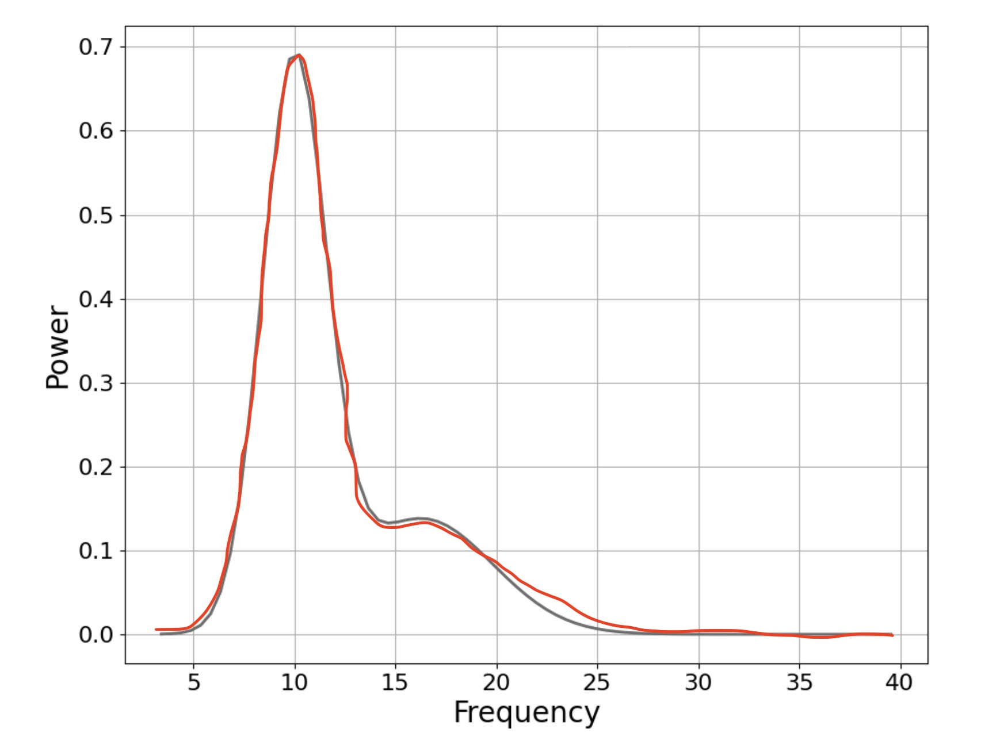
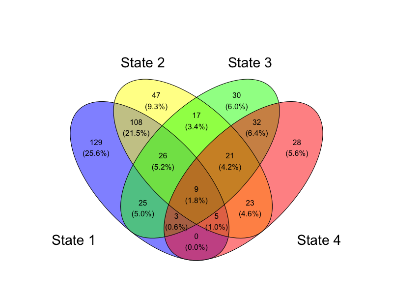

class: list-space

<style>

.list-space li {
padding: 0.25cm;
}

.list-nobullet li {
  list-style-type:none;
}

.center2 {
  margin: 0;
  position: absolute;
  top: 30%;
  left: 40%;
  -ms-transform: translate(-35%, -35%);
  transform: translate(-35%, -35%);
}


</style>


```{r setup, load_refs, include=FALSE, cache=FALSE}
library(ggplot2)
library(dplyr)
library(tidyr)
library(scales)
library(RColorBrewer)
library(kableExtra)
library(purrr)


setwd("~/Dropbox/QUT_MPhil/1-ThesisMaster/4-MILESTONES/Milestone3_FinalSeminar/final_seminar")

knitr::opts_chunk$set(cache = T, echo=F)

```
#### Mental Health in Adolescence

---
#### Mental Health in Adolescence
.content-box-blue[
- Mental health issues are a significant and growing problem in youth populations (Sawyer et al., 2018; McGorry & Mei, 2018)]
--
.content-box-red[
- Many mental health problems & disorders are thought to emerge in adolescence; period of rapid brain development and change (Paus et al., 2008; McGorry et al., 2011)]
--
.content-box-green[
- Mental health risk in childhood & adolescence is understood to be **pluripotential**
  - Non-specific risk overlaps across a number of clinical diagnostic categories (Raballo & Poletti, 2020; Hartmann et al., 2019)]
--

`r emo::ji("backhand index pointing right")` We need **improved data-driven statistical modeling** to better understand the <br> **complex relationships between neurophysiology and mental health in adolescence** `r emo::ji("brain")`

---
### Case-control and Data-driven Approaches

.pull-left[.content-box-blue[
**Case-control studies**
{{content}}
]]
--

- Identifies differences between diagnosed and undiagnosed groups
{{content}}

--

- Limited to find information within diagnostic categories based on clinical judgement
{{content}}

--

- Limited generalisability / replicability outside of sample (Latzman & DeYoung, 2020)


--

.pull-right[.content-box-red[
**Data-driven empirical methods**
{{content}}
]]
--

- Identifies subgroups of symptoms or individuals based on patterns in data, rather than diagnostic categories / clinician judgement
{{content}}
--

- Prioritises population-based cohort studies (Latzman & DeYoung, 2020)
{{content}}
--

- Growing emphasis on data-driven electroencephalography (EEG) research to find new discoveries out of scope from traditional diagnostic categories (Loo et al., 2016; Keizer, 2019)


---
background-image: url("imgs/eeg_diag.png")
background-position: top right
background-size: 450px

### Electroencephalography (EEG) Data

- Records electrical brain activity <br> using electrodes on the scalp

- Signals represent cumulative activity <br> of rhythmic firing across networks <br> of many neurons <br>

--
.pull-left[.content-box-blue[
**Strengths**
{{content}}
]]
--
- High temporal resolution for measuring oscillations & dynamic brain states (Burle et al., 2015)

{{content}}
--

- Low cost, widely available (Liedorp et al., 2009)

{{content}}
--

- Non-invasive, low participant burden

--

.pull-right[.content-box-red[
**Challenges**

{{content}}
]]
--
- Low signal-to-noise ratio (Wu et al., 2015)
  - Eye and muscle movements
  - Background electrical noise
  - Electrode contact quality
  
{{content}}
--

- Non-stationary (Sun and Zhou, 2014)
  - Significant variation in underlying processes

{{content}}
--

- High dimensionality 
  - Large number of channels & features


---

#### Growing need for increased large scale research studies collecting data on brain, psychopathology and cognitive function

--

.pull-left[.content-box-red[
**Longitudinal Adolescent Brain Study (LABS)**
{{content}}
]]
--
- Longitudinal cohort study of youth in the Sunshine Coast

- Follows participants from age 12 - 17

- Recruitment goal: 500 participants

{{content}}
--
Thesis data scope:
- 59 individuals aged 12 years (T1)

- Resting state EEG, psychological distress, <br> sleep quality, cognitive function

- Chapters 3 & 4

--

.pull-right[.content-box-green[
**Healthy Brain Network (HBN)**

{{content}}
]]
--
- Large cross-sectional study in New York region

- Participants aged 5-21

- Goal: Biobank of 10,000 participants

{{content}}
--
Thesis data scope:

- 503 participants aged 9-15

- Pre-processed resting state EEG, <br> psychopathology and cognitive function

- Chapters 5 & 6


---

class: middle, center

# Aims & Objectives


---

### Applied Motivation


<br>
<br>


.content-box-green[
Develop novel statistical methods to identify data-driven EEG phenotypes in adolescents
]

--

<br>
<br>

.content-box-yellow[
Investigate relationships of phenotypes to psychopathology and cognitive function, with potential applications in personalised healthcare, risk prediction and early intervention
]

---

.pull-left[.content-box-red[
(1) Develop an end-to-end pipeline for EEG-based clusters in adolescents **(Ch 3)**
]]

--
.pull-right[.content-box-red[
(1a) Using LABS data, examine associations with health measures. **(Ch 3 & 6)**
]]

--
.pull-left[.content-box-yellow[
(2) Build Bayesian Model Averaging framework to combine clusters with probabilistic allocation & model-based uncertainty **(Ch 4)**
]]

--
.pull-right[.content-box-yellow[
(2a) Assess clinical & applied utility of BMA features with case study using LABS EEG clusters **(Ch 4 & 6)**
]]

--
.pull-left[.content-box-green[
(3) Develop nested functional analysis framework for time series data including functional characteristics in latent states **(Ch 5)**
]]

--
.pull-right[.content-box-green[
(3a) Investigate associations between functional analysis outputs & health measures using HBN data **(Ch 5 & 6)**
]]

--
.pull-left[.content-box-blue[
(4) Replicate and compare feature extraction and clustering pipelines (1) and (3) across LABS and HBN data **(Ch 6)**
]]

--
.pull-right[.content-box-blue[
(4a) Explore cross-method, cross-sample replication of robust EEG phenotypes in adolescents using methods in (1) and (3) **(Ch 6)**
]]


---
background-image: url("imgs/watercolour_crop_nologo.jpg")

class: middle, center 

# Chapter 3
# EEG-based clusters differentiate psychological distress, sleep quality and cognitive function in adolescents

---
### Chapter 3: Novel Contributions

--

- First work to investigate phenotypes using unsupervised clustering of EEG data from a population sample of adolescents

--

- New insights about the presence of resting state EEG phenotypes, and clear associations with psychological distress, sleep quality and cognitive function

--

- Novel statistical pipeline implemented in **freely available open source software** (R and MATLAB) for clinicians and researchers to apply in their own work


--

- SAGE Award for Best HDR Student Publication (Faculty of Science) 2022

--

- Published in _Biological Psychology_

<center>
```{r out.width = 450}

```
</center>

---

### Chapter 3: Methods
<center>
```{r out.width = 800}


```
</center>

--

<br>
- Time-averaged summary features selected _a priori_
.pull-right[
```{r out.width = 350}

```
]
--

- Dimension Reduction with PCA

--

- 3 clustering algorithms

--

- Overlapping 'core' clusters 

---
##### Chapter 3: Results

--
.pull-left[
```{r out.width = 300}

```
```{r out.width = 350}

```
]

--

.pull-right[
```{r out.width = 400}


```

```{r out.width = 450}


```
]

---

### Exciting preliminary results

- Clusters have distinct EEG characteristics and substantial differences in mental health and cognition

- Indicate resting state EEG phenotypes in adolescents, potential *risk* and *protective* biomarkers

--
.content-box-yellow[
Can we develop a better way to combine multiple clustering algorithms, incorporating model-based uncertainty? **(Chapter 4)**
]
--
.content-box-green[
Can we use more sophisticated methods to characterise EEG, include temporal information, and avoid coarse canonical summary features? **(Chapter 5)**
]
--
.content-box-blue[
How robust are the phenotypes associated with these clusters? Do we find similar results using different samples, and different methods? **(Chapter 6)**
]


---
background-image: url("imgs/watercolour_crop_nologo.jpg")

class: middle, center 
# Chapter 4
# _clusterBMA_: Bayesian Model Averaging for Clustering


---

### Chapter 4: Novel Contributions

--

- First implementation of Bayesian model averaging to combine solutions across multiple clustering algorithms

--

- Offers unique features for ensemble clustering including **quantification of model-based uncertainty** and probabilistic allocation to combined clusters

--

- Substantially better accuracy in benchmarking performance compared to other ensemble algorithms, particularly for high-dimensional data with low separation between clusters

--

- Implemented in open source & freely available **R package** for data scientists & practitioners to apply across various fields

--

- Preprint has been cited

- Trending on DeepAI

- Used by researchers at UWA and US government agency

--

.content-box-red[
**Under review in _PLOS ONE_**
]

---


## Which clustering algorithm?


.pull-left[<iframe src="imgs/plot_3d_km.html" width="500" height="250" scrolling="yes" seamless="seamless" frameBorder="0"> </iframe>]

.pull-right[<iframe src="imgs/plot_3d_hc_colourfix.html" width="500" height="250" scrolling="yes" seamless="seamless" frameBorder="0"> </iframe>]

.pull-left[<iframe src="imgs/plot_3d_gmm.html" width="500" height="250" scrolling="yes" seamless="seamless" frameBorder="0"> </iframe>]


---

## Inconsistent clustering across algorithms

<iframe src="imgs/plot_3d_core_yellow.html" width="1000" height="500" scrolling="yes" seamless="seamless" frameBorder="0"> </iframe>


---

### Which clustering algorithm?

- Different algorithms will emphasise different aspects of clustering structure

--

- Choosing one 'best' model often arbitrary, unclear choice

--

  - `r emo::ji("right arrow")` **Inference not calibrated for model-based uncertainty**

--

- Locking into one method loses insights offered by other methods about plausible clustering structure

--

.pull-left[
```{r out.width=800}


```
]

--

.pull-right[
**BMA offers a nice framework for combining clustering solutions**

  - simple
  
  - flexible

  - intuitive 
]

---


### Combining Clustering Results with Bayesian Model Averaging

--

- Limited development for Clustering
  - Finite mixture models (Russell et al., 2015)
  - Naive Bayes classifiers (Santafe & Lozano, 2006)
  - Lacks implementation across multiple clustering algorithms

--
<br>

**Advantages**

- `r emo::ji("cool")` Weighted averaging of results incorporating model quality / goodness of fit

--

- `r emo::ji("100")` Intuitive framework for **probabilistic** inferences combining results from **different clustering algorithms**

--

- `r emo::ji("wow")` Each input solution can have a different number of clusters $K$

--

- `r emo::ji("sunglasses")` **Quantify model-based uncertainty and enable more robust inferences** calibrated accordingly


---

### Bayesian Model Averaging: Basics

<br>
<br>

$$P(\Delta | Y) = \sum_{l=1}^L (\Delta | Y, M_l)P(M_l|Y)$$


--
<br>
<br>

$$P(M_l|Y) = \frac{P(Y|M_l)P(M_l)}{\sum_{l=1}^L P(Y|M_l)P(M_l)}$$


---

#### BMA for Mixture Models - BIC weighting
- $P(Y|M_l)$ typically involves a difficult/intractable integral and is often approximated for many applications (Fragoso et al., 2018)

--

- **Russell et al. (2015)** weight results from multiple GMMs according to BIC

$$P(M_l \lvert Y) \approx \frac{exp(\frac{1}{2}{BIC}_l )}{\sum_{l=1}^L { exp(\frac{1}{2} BIC_{l}) }}$$

--

- BIC definition for GMM

$${BIC}_l = 2\log(\mathcal{L}) - \kappa_m \log(N)$$

--

- GMM likelihood

$$\mathcal{L}(\Theta) = \sum_{n=1}^N \sum_{k=1}^K{\pi_k\mathcal{N}(x_n|\mu_k, \Sigma_k)}$$
--

- Multivariate Gaussian density

$$\mathcal{N}(x|\mu, \Sigma) = \frac{\exp\left\{ -\frac{1}{2} (y-\mu)^T \Sigma^{-1}(y-\mu)\right\}}{|\Sigma|^{\frac{1}{2}} (2 \pi)^{\frac{D}{2}}}$$
                 
                 
---
background-image: url("imgs/separation_compactness.png")
background-position: right
background-size: 600px

### Aside: Cluster internal validation indices

.pull-left[.content-box-blue[
- Often used as a proxy for model quality in clustering
{{content}}
]
]
--

- Choose between candidate models with different numbers of clusters $k$

{{content}}
--

- Interpreted similarly to marginal likelihood/model evidence

{{content}}
--

- Typically measure compactness and/or separation of clusters

{{content}}
--
Compared to BIC...
  - Agnostic to clustering algorithm
  - Typically do not require likelihood term

---
background-image: url("imgs/separation_compactness.png")
background-position: top right
background-size: 300px


### New proposed weighting / approximation for posterior model probability

BIC for GMM driven by **Multivariate Gaussian density:**

$$\mathcal{N}(x|\mu, \Sigma) = \frac{\exp\left\{ -\frac{1}{2} (y-\mu)^T
                 \Sigma^{-1}(y-\mu)\right\}}{|\Sigma|^{\frac{1}{2}} (2 \pi)^{\frac{D}{2}}}$$
                 

--

**Calinski-Harabasz Index**
- Ratio of separation to compactness (maximise)
$$CH = \frac{\sum_i{n_i d^2(c_i,c)/(NC-1)}}{\sum_i{\sum_{x \in C_i}d^2(x,c_i)/(n-NC)}}$$

--

**S_Dbw Index**

- Sum of intra-cluster scattering and inter-cluster density (minimise)
<center>
```{r out.width=400}
knitr::include_graphics("imgs/S_Dbw_short.jpeg")
```
</center>


- CH and S_Dbw indices are both well validated in the context of comparing model quality across different clustering algorithms

---

### New proposed weighting / approximation for posterior model probability

CH and S_Dbw indices
- conceptually and mathematically similar to BIC
- Unlike BIC, can be calculated + directly compared across different clustering algorithms

--

New proposed weight:
<!-- $$P(Y \lvert \mathcal{M}_m) \approx \hat{\mathcal{W}}_m \coloneqq \begin{cases} -->
<!--   \frac{\mathcal{W}_m}{\sum_{m'=1}^M \mathcal{W}_{m'}} & \text{if $\mathcal{W}_m$ is to be maximised} \\ -->
<!--   \\ -->
<!--   \frac{\frac{1}{\mathcal{W}_m}}{\sum_{m'=1}^M \frac{1}{\mathcal{W}_{m'}}} & \text{if $\mathcal{W}_m$ is to be minimised,} -->
<!--   \end{cases}$$ -->


.center[
```{r out.width=800}

```
]


<br>

--

Approximate posterior model probability for weighted averaging:
$$P(\mathcal{M}_m \lvert Y) \approx \frac{\hat{\mathcal{W}}_m \left(\frac{1}{M}\right)}{\sum_{m'=1}^M \hat{\mathcal{W}}_{m'} \left(\frac{1}{M}\right)} = \hat{\mathcal{W}}_m.$$


---


### Consistent quantity $\Delta$ - Similarity matrices

Previous work (Russell et al., 2015) has used pairwise similarity matrices as $\Delta$ for each model

--

- To get similarity matrix, multiply allocation matrix by its transpose:

$$S_m = A_m A_m^T$$

- **invariant to number and labelling of clusters across solutions**

--

.center[
```{r out.width=800}

```
]


---

### Consensus matrix

.center[
```{r out.width=600}

```
]

\begin{equation}
  C = {\sum_{m=1}^M\hat{\mathcal{W}}_m S_m}.
\end{equation}

---

### Consensus matrix `r emo::ji("right arrow")` Matrix factorisation `r emo::ji("right arrow")` Cluster allocation probabilities

- Symmetric Simplex Matrix Factorisation (SSMF; Duan, 2020) to get $N \times  K$ allocation matrix $A_m$ from $N \times N$ consensus matrix $C$

- Generates probabilistic cluster allocations from pairwise probabilities

--

.center[
```{r out.width=700}
knitr::include_graphics("imgs/c_to_a.png")
```
]
--

- Includes L2 regularisation step to reduce overfitting & redundant clusters


---


class: center, middle


## Case study: Clustering adolescents based on resting state EEG recordings


---

### Model results


.center[
```{r out.width=1000}
knitr::include_graphics("imgs/clusters_scrnshot.jpg")
```
]

---

### Model results `r emo::ji("right arrow")` Similarity matrices

.pull-left[**k-means** $\hat{\mathcal{W}}_m = 0.36$
<br>
```{r out.width=300}
knitr::include_graphics("imgs/km_similarity.png")
```
]

.pull-right[**HC** $\hat{\mathcal{W}}_m = 0.27$
<br>
```{r out.width=300}

```
]

.pull-left[**GMM** $\hat{\mathcal{W}}_m = 0.37$
<br>
```{r out.width=300}
knitr::include_graphics("imgs/gmm_similarity.png")
```
]


---

### Model results `r emo::ji("right arrow")` Similarity matrices `r emo::ji("right arrow")` Consensus matrix

```{r out.width=800}

```


---

### BMA Clusters with allocation uncertainty

.center[
<iframe src="imgs/eeg_3d_BMA_size_uncertainty_301122.html" width="750" height="400" scrolling="yes" seamless="seamless" frameBorder="0"> </iframe>
]


- **Uncertainty can be propagated forward for further analysis in a Bayesian framework**


---

### Benchmarking study: Feature comparison with other ensemble approaches

<center>
```{r out.width=1000}

```
</center>

---
### Benchmarking study: Accuracy comparison

- 9 clustering algorithms
- Simulated data with differing dimensions (2, 10, 50) and separation (high, medium, low)
- 10 simulated datasets for each combination of dimensions X separation

--
<center>
```{r out.width=850}

```
</center>

---

class: center, middle


## A quick demo

---

<iframe src="imgs/demo_recording_1080_tripspeed_changed.mp4" width="1000" height="650" scrolling="yes" seamless="seamless" frameBorder="0"> </iframe>


---

background-image: url("imgs/bernie_meme.jpg")
background-position: center
background-size: contain

---
background-image: url("imgs/watercolour_crop_nologo.jpg")

class: middle, center

# Chapter 5
# Functional analysis within latent states for neuroscientific data: Linking resting state brain activity, psychopathology and cognitive function in young people


---


### Chapter 5: Novel Contributions

--

- Novel nested framework for functional data analysis (FDA) of functional time series data

--

- Integrated analysis of functional latent states using FHMM, and functional characteristics within states using FPCA

--

- More nuanced insights into variation in resting state EEG, less reliant on flawed assumptions and canonical features

--

- In HBN data, Bayesian regression models show substantial assocations of temporal dynamics and functional characteristics within states, with measures of psychopathology and cognitive function

--

- Lays a foundation for more sophisticated phenotype identification including temporal and functional characteristics (Chapter 6)
--

- Implemented in open source & freely available software in R for practitioners to apply across various fields

--
.content-box-red[
**In preparation for submission to _Statistical Methods in Medical Research_**
]


---


### Functional analysis within latent states - Overview

<center>
```{r out.width=1000}

```
</center>


---

.center[Functional analysis within latent states]

---

.center[**F**unctiona**L** **A**nalysis **W**ithin **L**at**E**nt **S**tate**S**]

--

.center[( **_flawless_** )]


--

<br>
<br>

<center>
```{r out.width=600}
knitr::include_graphics("imgs/beyonce_flawless.gif")
```
</center>
---


#### Functional Data Analysis (FDA)

- Data represented as functions -- e.g. curves over a continuous functional domain like time or frequency

- Analyse influential characteristics across the whole functional domain of interest

- Copes well with high dimensionality of neuroscience data

--

.pull-left[
```{r out.width = 400}

```

Summary features selected _a priori_]

--

.pull-right[
```{r out.width = 400}

```

FDA - information across whole curve
]


---

#### Functional Hidden Markov Models

<center>
```{r out.width = 350}

```
</center>

--

Objective Function

<center>
```{r out.width = 500}

```
</center>

--

- Similar to regular HMM, but emission function is not a PDF --> function based on L2 distance measure between each curve and mean curve for each state (Martino 2020)

<center>
```{r out.width = 700}

```
</center>

---

#### Functional Principal Component Analysis

.content-box-red[
Captures the essential patterns of variation in functional data in terms of scores on **eigenfunctions** (Ramsay et al., 2009)
]
--

FPCA expansion

<center>
```{r out.width = 850}

```
</center>

--
<br>
Finite n. of functional principal components, $C$

<br>
<br>
<center>
```{r out.width = 850}

```
</center>


---

### _flawless_  analysis - Overview
<center>
```{r out.width=600}

```
</center>

---

### FHMM - Latent State Centroids

<center>
```{r out.width=800}
knitr::include_graphics("imgs/FHMM_centroids_230423.png")
```
</center>

---

### FHMM - Latent State Occupancy

.pull-left[
```{r out.width=400}

```

Most common combinations:
- State 1 only (25.6%)
- States 1 and 2 (21.5%)
- State 2 only (9.3%)
- States 3 and 4 (6.4%)
- State 3 only (6.0%)
- State 4 only (5.6%).
]

--
.pull-right[
```{r out.width=550}

```

- Most visit 1 (n = 234; 46.5%) or 2 (n = 205; 40.8%) latent states

- A majority (n = 479; 95.2%) make between 0 and 4 transitions between states over the recording period.

]
---

- Rich & nuanced empirical insights: Functional latent states; Temporal dynamics; Functional variation within states

- Bayesian Regression models: Substantial associations between FHMM & FPCA-within-state outputs, psychopathology and cognitive function

--

.content-box-blue[**Relative to traditional methods**: 
Less information loss; Fewer flawed assumptions from canonical summary features; Broadens scope beyond traditional features of interest
]
--

.content-box-yellow[**Relative to either method alone**:
Avoids compressing over distinct latent states (vs. FPCA alone); Identifies functional variation within states (vs. FHMM alone)
]
--

.content-box-green[**Relative to multi-dimensional functional analyses for EEG**:
Integrated insights + relationships across multiple levels of analysis; Better interpretability at each level
]

---

background-image: url("imgs/watercolour_crop_nologo.jpg")

class: middle, center 
# Chapter 6
# Data-driven phenotypes of resting state brain activity in adolescents: Cross-method, cross-sample replication and extension using functional analyses


---

#### Chapter 6: Novel Contributions

.content-box-blue[(1) **Cross-sample replication** of phenotypes from Chapter 3 clustering (Summary Features) across LABS and HBN datasets
]
--

.content-box-yellow[(2) **Cross-method replication** of phenotypes from Chapter 3 (Summary Features) and Chapter 5 (FHMM States) with HBN data
]

--

.content-box-green[(3) **Extension of phenotypes** by clustering _flawless_ analysis outputs for latent state dynamics and FPC scores with HBN data
]

--

- Replication indicates more substantial evidence & lays foundation for clinical utility in the context of personalised healthcare and risk prediction

--

.content-box-red[In preparation for submission to _Nature Neuroscience_ 
]

---
#### (1) **Cross-sample replication** of Chapter 3 clustering across LABS and HBN datasets

.pull-left[
```{r out.width=400}

```
]

.pull-right[
```{r out.width=400}

```
]


---

<center>
```{r out.width=800}

```

```{r out.width=200}

```
</center>

---

#### Health characteristics across Pipeline 1 clusters (time-averaged summary features)

<center>
```{r out.width=600}

```
</center>

---
#### (2) **Cross-method replication** of clustering from Chapter 3 (Summary Features) and Chapter 5 (FHMM States) with HBN data

.pull-left[
```{r out.width=400}

```
]

.pull-right[
```{r out.width=400}

```
]

.pull-right[
```{r out.width=300}

```
]

---

#### (3) **Extension of phenotypes** by clustering ( _flawless_ ) outputs for latent state dynamics and FPC scores with HBN data

<center>
```{r out.width=700}

```
</center>


---


<br>


.content-box-green[`r emo::ji("brain")` `r emo::ji("star")` Cross-method, cross-sample replication of resting state EEG phenotypes in adolescents, and extension of more sophisticated phenotypes based on latent states, temporal dynamics, and functional characteristics within states]

--
<br>

.content-box-purple[`r emo::ji("fire")` `r emo::ji("cool")` `r emo::ji("sunglasses")` Strong foundation for potential clinical applications - risk/protective biomarkers, support early intervention and care planning personalised medicine `r emo::ji("100")``r emo::ji("100")``r emo::ji("100")`
]

---
# Limitations

.content-box-red[Cross-sectional data - limits understanding of phenotypes and health measures changing within individuals over time
]
--

<br>
.content-box-red[Single-electrode data - limits understanding of spatial patterns of brain activity and functional connectivity
]

--

.content-box-red[EEG only - we did not look at other neuroimaging modalities
]

---
# Future Directions


.content-box-green[
- Longitudinal data & time-series analyses - understand longer term patterns of change and health risk

- Multi-electrode data - investigate spatial patterns & functional connectivity

- Combine EEG with other neuroimaging modalities (e.g. Diffusion Tensor Imaging, Functional MRI)
]

--

.content-box-yellow[
- Fully Bayesian implementations of _clusterBMA_ and _flawless_
]

--

.content-box-blue[
- Development of user-friendly software with GUIs for testing in clinical settings
]

---

# Acknowledgements


* Supervisors: Kerrie Mengersen, Paul Wu and Edgar Santos-Fernandez 


* Panel members: David Lovell, Kate Helmstedt


* PhD stipend and travel funding: Kerrie, QUT, CDS, ACEMS, SSA, IBS-AR


* Researchers, Participants & Caregivers for LABS and HBN studies


* Collaborators: Paul Schwenn, Hongbo Xie


* Friends, family, my partner Satomi

--

- _clusterBMA_  R package: **bit.ly/clusterBMA** 

```{r out.width=100}

```

--

- `r emo::ji("bird")` Twitter: **@oforbes22**


---


### References

Aggarwal, C. C. and Reddy, C. K. (2014). Data clustering: Algorithms and applications. Chapman Hall/CRC Data mining and Knowledge Discovery Series. London.

Babadi, B., & Brown, E. N. (2014). A review of multitaper spectral analysis. IEEE Transactions on Biomedical Engineering, 61(5), 1555-1564.

Bernardo, J. M. and Smith, A. F. (2009). Bayesian theory, volume 405. John Wiley Sons.

Bruckers, L., Molenberghs, G., Drinkenburg, P., & Geys, H. (2016). A clustering algorithm for multivariate longitudinal data. Journal of biopharmaceutical statistics, 26(4), 725-741.

Burle, B., Spieser, L., Roger, C., Casini, L., Hasbroucq, T., and Vidal, F. (2015). Spatial and temporal resolutions of EEG: Is it really black and white? A scalp current density view. International Journal of Psychophysiology, 97(3):210-220.

Cohen, M. X. (2014). Analyzing neural time series data: theory and practice. MIT press.

Connell, A. M., & Frye, A. A. (2006). Growth mixture modelling in developmental psychology: Overview and demonstration of heterogeneity in developmental trajectories of adolescent antisocial behaviour. Infant and Child Development: An International Journal of Research and Practice, 15(6), 609-621.

---
### References

de Lijster, J. M., van den Dries, M. A., van der Ende, J., Utens, E. M., Jaddoe, V. W., Dieleman, G. C., ... & Legerstee, J. S. (2019). Developmental trajectories of anxiety and depression symptoms from early to middle childhood: A population-based cohort study in the Netherlands. Journal of abnormal child psychology, 47(11), 1785-1798.

Duffy, F. H., McAnulty, G. B., and Albert, M. S. (1996). Effects of age upon interhemispheric EEG coherence in normal adults. Neurobiol. Aging 17, 587– 599. doi: 10.1016/0197-4580(96)00007-3

Feng, J., Xu, H., & Yan, S. (2012). Robust PCA in high-dimension: A deterministic approach. arXiv preprint arXiv:1206.4628.

Hartmann, J. A., Nelson, B., Spooner, R., Paul Amminger, G., Chanen, A., Davey, C. G., McHugh, M., Ratheesh, A., Treen, D., and Yuen, H. P. (2019). Broad clinical high-risk mental state (CHARMS): methodology of a cohort study validating criteria for pluripotent risk. Early Intervention in Psychiatry, 13(3):379-386.

Jin, X., Liang, X., & Gong, G. (2020). Functional integration between the two brain hemispheres: evidence from the homotopic functional connectivity under resting state. Frontiers in Neuroscience.

Kaiser, A. K., Gnjezda, M. T., Knasmüller, S., & Aichhorn, W. (2018). Electroencephalogram alpha asymmetry in patients with depressive disorders: current perspectives. Neuropsychiatric disease and treatment.

---
### References

Keizer, A. W. (2019). Standardization and Personalized Medicine Using Quantitative EEG in Clinical Settings. Clinical EEG and neuroscience, page 1550059419874945.

Ke, L., & Li, R. (2009, November). Classification of EEG signals by multi-scale filtering and PCA. In 2009 IEEE International Conference on Intelligent Computing and Intelligent Systems (Vol. 1, pp. 362-366). IEEE.

Latzman, R. D. and DeYoung, C. G. (2020). Using empirically-derived dimensional phenotypes to accelerate clinical neuroscience: The Hierarchical Taxonomy of Psychopathology (HiTOP) framework. Neuropsychopharmacology, 45(7):1083-1085.

Liedorp, M., Van Der Flier, W., Hoogervorst, E., Scheltens, P., and Stam, C. (2009). Associations between patterns of EEG abnormalities and diagnosis in a large memory clinic cohort. Dementia and geriatric cognitive disorders, 27(1):18-23.

Loo, S. K., Lenartowicz, A., and Makeig, S. (2016). Research review: Use of EEG biomarkers in child psychiatry research{current state and future directions. Journal of Child Psychology and Psychiatry, 57(1):4-17.

Margaritella, N., Inácio, V., & King, R. (2021). Parameter clustering in Bayesian functional principal component analysis of neuroscientific data. Statistics in Medicine, 40(1), 167-184.

McGorry, P. D. and Mei, C. (2018). Early intervention in youth mental health: progress and future directions. Evidence-based mental health, 21(4):182-184.

---
### References

McGorry, P. D., Purcell, R., Goldstone, S., and Amminger, G. P. (2011). Age of onset and timing of treatment for mental and substance use disorders: implications for preventive intervention strategies and models of care. Current opinion in psychiatry, 24(4):301-306.

Newson, J. J., & Thiagarajan, T. C. (2019). EEG frequency bands in psychiatric disorders: a review of resting state studies. Frontiers in human neuroscience, 12, 521.

Paus, T., Keshavan, M., and Giedd, J. N. (2008). Why do many psychiatric disorders emerge during adolescence? Nature reviews neuroscience, 9(12):947-957.

Prerau, M. J., Brown, R. E., Bianchi, M. T., Ellenbogen, J. M., & Purdon, P. L. (2017). Sleep neurophysiological dynamics through the lens of multitaper spectral analysis. Physiology, 32(1), 60-92.

Sawyer, M. G., Reece, C. E., Sawyer, A. C., Johnson, S. E., and Lawrence, D. (2018). Has the prevalence of child and adolescent mental disorders in Australia changed between 1998 and 2013 to 2014? Journal of the American Academy of Child Adolescent Psychiatry, 57(5):343-350. e5.

Sun, S. and Zhou, J. (2014). A review of adaptive feature extraction and classification methods for EEG-based brain-computer interfaces. In 2014 International Joint Conference on Neural Networks (IJCNN), pages 1746-1753. IEEE.

---
### References

Raballo, A. and Poletti, M. (2020). Advances in early identification of children and adolescents at risk for psychiatric illness. Current Opinion in Psychiatry, 33(6):611-617.

Ramsay, J. O., Hooker, G., & Graves, S. (2009). Functional data analysis with R and MATLAB: Springer Science & Business Media.

Tenke, C. E., & Kayser, J. (2005). Reference-free quantification of EEG spectra: combining current source density (CSD) and frequency principal components analysis (fPCA). Clinical Neurophysiology, 116(12), 2826-2846.
Chicago	

Wu, W., Nagarajan, S., and Chen, Z. (2015). Bayesian Machine Learning: EEGMEG signal processing measurements. IEEE Signal Processing Magazine, 33(1):14-36.


---


### FPCA & Bayesian Regression


.pull-left[

```{r out.width=450}

```

- Bayesian regression models indicated substantial associations between:

* Latent state temporal characteristics

* **Functional frequency characteristics within states (FPCA scores)**

* Outcome: Health measures relating to psychopathology & cognitive function
]
--

.pull-right[
```{r out.width=300}
knitr::include_graphics("imgs/s3_regression.png")
```
]

---


#### Answer to Conor's Question - Exciting Findings from Chapter 6 `r emo::ji("sunglasses")` (extended phenotypes)

.pull-left[
```{r out.width=450}

```
]

--

.pull-right[

- Clusters based on FHMM and FPCA outputs from all latent states

```{r out.width=450}

```
]


---

<center>
```{r out.width=800}

```
</center>

---

<center>
```{r out.width=700}

```
</center>


---


### FHMM Details

<center>
```{r out.width = 1000}

```
</center>


---

### S_Dbw Details


<center>
```{r out.width = 1000}

```
</center>


---
.pull-left[
#### *k*-means

- 'Hard' clustering
- Minimises within-cluster sums of squares]


.pull-right[**k-means objective function** <br>
$$J = \sum_{i = 1}^K (\sum_k{\lvert \lvert x_k - c_i \rvert \rvert ^2})$$]

--

.pull-left[
#### Hierarchical Clustering (Ward's Method)

- 'Hard' clustering
- Each observation starts out in its own cluster
- Repeated pairwise fusion of clusters that minimises change in within-cluster sums of squares (Ward)]


.pull-right[**Ward's objective function** <br>
$$D(c_1,c_2) = \delta^2(c_1,c_2) = \frac{\lvert c_1 \rvert \lvert c_2 \rvert }{\lvert c_1 \rvert + \lvert c_2 \rvert} \lvert \lvert c_1 - c_2 \rvert \rvert ^2$$]

--

.pull-left[
#### Gaussian Mixture Model
- 'Soft' clustering
- Models data as coming from a mixture of Gaussian distributions
- Restrictive distribution ('thin tails')
  - Tends to prioritise cluster compactness, may tend to 'overcluster']

.pull-right[**Mixture of multivariate Gaussians** <br>
$$p(x_n|\mu, \Sigma, \pi,K) = \sum_{k=1}^K{\pi_k\mathcal{N}(x_n|\mu_k, \Sigma_k)}$$]


---


#### Chapter 3 details - Summary Features

**Features**

- Power in canonical bands -- Delta (0-4 Hz), ..., Beta (12-16 Hz)

- Total Power

- Individual Alpha Frequency

- Spectral Edge Frequency

- Spectral Entropy


**Principal Component Analysis**
- 3 PCs explained 80.6% of the variance


**Clustering**

- k-means

- Hierarchical Clustering

- Gaussian Mixture Model


